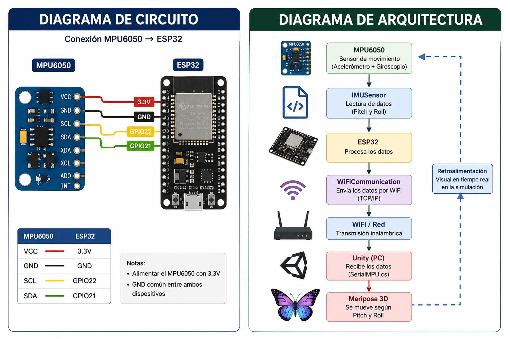

#  Robot Mariposa Biomimético

## Descripción

Este proyecto consiste en el desarrollo de un robot biomimético inspirado en el movimiento de una mariposa. El sistema fue dividido en dos módulos principales:

- Simulación virtual en Unity utilizando un ESP32 y un sensor MPU6050.
- Sistema físico de aleteo utilizando un Arduino Pro Mini y dos servomotores.

El objetivo es reproducir el movimiento de una mariposa mediante la inclinación de un sensor MPU6050, permitiendo controlar el desplazamiento del modelo virtual y, posteriormente, el movimiento físico de las alas.

---

# Características

- Comunicación inalámbrica mediante WiFi.
- Simulación 3D en Unity.
- Lectura de orientación mediante MPU6050.
- Movimiento basado en Pitch y Roll.
- Arquitectura modular utilizando Programación Orientada a Objetos.
- Aplicación de principios SOLID.
- Organización del proyecto mediante programación por capas.

---

# Hardware utilizado

## Módulo ESP32

- ESP32 Dev Module
- Sensor MPU6050
- Protoboard
- Cables Dupont
- Alimentación USB

## Módulo de Aleteo

- Arduino Pro Mini
- Receptor FlySky iBUS
- 2 Servomotores
- Fuente de alimentación

---

# Software utilizado

- Arduino IDE
- Unity
- Visual Studio Code
- GitHub

---

# Librerías utilizadas

## ESP32

- WiFi.h
- Wire.h
- MPU6050.h

## Arduino

- Servo.h
- IBusBM.h

---

# Organización del proyecto

```
Robot-Mariposa-ESP32-Unity
│
├── esp32/
│   ├── Mariposa.ino
│   ├── MotionData.h
│   ├── IMUSensor.h
│   ├── MovementMath.h
│   ├── WiFiCommunication.h
│   └── ButterflyController.h
│
├── unity/
│   ├── NetworkManager.cs
│   ├── ButterflyMovement.cs
│   ├── CameraFollow.cs
│   └── UIManager.cs
│
├── imgs/
│
├── video/
│
└── README.md
```

---

# Descripción de las carpetas

## esp32

Contiene el código del ESP32 encargado de leer el sensor MPU6050, procesar los valores de Pitch y Roll y enviarlos mediante WiFi hacia Unity.

Las clases fueron separadas para facilitar el mantenimiento del código y aplicar Programación Orientada a Objetos.

### MotionData.h

Contiene la estructura donde se almacenan los datos de Pitch y Roll.

### IMUSensor.h

Se encarga únicamente de inicializar y leer el sensor MPU6050.

### MovementMath.h

Contiene las funciones matemáticas utilizadas para calcular Pitch y Roll.

### WiFiCommunication.h

Administra la conexión WiFi entre el ESP32 y Unity.

### ButterflyController.h

Procesa la información recibida del sensor aplicando la zona muerta antes de enviarla al sistema.

---

## unity

Contiene todos los scripts desarrollados para la simulación en Unity.

### NetworkManager.cs

Administra la comunicación TCP/IP con el ESP32.

### ButterflyMovement.cs

Controla el movimiento y la rotación de la mariposa dentro del escenario.

### CameraFollow.cs

Hace que la cámara siga automáticamente a la mariposa durante la simulación.

### UIManager.cs

Actualiza la interfaz gráfica mostrando el estado de conexión y los valores de Pitch y Roll.

---

## imgs

Contiene las imágenes utilizadas para documentar el proyecto.

- Diagrama de arquitectura.
- Diagrama del circuito.
- Capturas de Unity.
- Fotografías del prototipo.

---

## video

Contiene el video demostrativo del funcionamiento del proyecto.

---

# Cómo ejecutar el proyecto

## ESP32

1. Abrir el archivo Mariposa.ino en Arduino IDE.
2. Instalar las librerías necesarias.
3. Configurar el nombre y contraseña de la red WiFi.
4. Seleccionar la placa ESP32 Dev Module.
5. Compilar y cargar el programa.
6. Abrir el Monitor Serial para obtener la dirección IP.

---

## Unity

1. Abrir el proyecto en Unity.
2. Configurar la dirección IP del ESP32 en NetworkManager.cs.
3. Ejecutar la simulación presionando Play.
4. Inclinar el sensor MPU6050 para controlar el movimiento de la mariposa.

---

# Comunicación del sistema

La comunicación entre el ESP32 y Unity se realiza mediante WiFi utilizando el protocolo TCP/IP.

El ESP32 obtiene continuamente los valores de Pitch y Roll del sensor MPU6050 y los envía al computador. Unity recibe estos datos en tiempo real y actualiza la posición y orientación de la mariposa dentro del entorno virtual.
---

# Arquitectura del sistema

El proyecto fue diseñado siguiendo una arquitectura por capas para facilitar el mantenimiento, la reutilización del código y la escalabilidad del sistema.

## Capa de Presentación

Corresponde a la simulación desarrollada en Unity.

Está formada por los siguientes componentes:

- UIManager.cs
- CameraFollow.cs
- Modelo 3D de la mariposa
- Interfaz gráfica

Su función es mostrar visualmente el estado del sistema y representar el movimiento de la mariposa en tiempo real.

---

## Capa de Lógica

Es la encargada de procesar toda la información obtenida por el sensor.

Está conformada por:

- ButterflyController.h
- MovementMath.h
- ButterflyMovement.cs

En esta capa se realizan:

- Cálculo de Pitch.
- Cálculo de Roll.
- Zona muerta.
- Movimiento de la mariposa.
- Rotación del modelo.

---

## Capa de Acceso a Datos

Es la responsable de obtener los datos provenientes del hardware.

Está conformada por:

- IMUSensor.h
- MotionData.h

Su función consiste en inicializar el sensor MPU6050, leer los datos del acelerómetro y giroscopio y almacenarlos para su posterior procesamiento.

---

## Capa de Comunicación

Permite la comunicación entre el ESP32 y Unity mediante WiFi.

Está formada por:

- WiFiCommunication.h
- NetworkManager.cs

Su función es enviar y recibir continuamente los valores de Pitch y Roll para mantener sincronizado el sistema.

---

# Principios SOLID

Durante el desarrollo del proyecto se aplicaron diversos principios SOLID para mejorar la organización del software.

## Principio de Responsabilidad Única (SRP)

Cada clase tiene una única responsabilidad.

Ejemplos:

- IMUSensor únicamente lee el MPU6050.
- MovementMath únicamente realiza cálculos matemáticos.
- WiFiCommunication únicamente administra la conexión WiFi.
- NetworkManager únicamente recibe la información enviada por el ESP32.
- ButterflyMovement únicamente controla el movimiento del modelo 3D.

---

## Principio Abierto/Cerrado (OCP)

El sistema permite agregar nuevos sensores o nuevos métodos de comunicación sin modificar las clases existentes.

Por ejemplo, sería posible reemplazar la comunicación WiFi por Bluetooth implementando una nueva clase de comunicación.

---

## Principio de Sustitución de Liskov (LSP)

Las clases fueron diseñadas para poder modificarse o ampliarse sin afectar el funcionamiento del resto del sistema.

---

## Principio de Segregación de Interfaces (ISP)

Las responsabilidades fueron divididas en clases pequeñas evitando crear clases con múltiples funciones diferentes.

---

## Principio de Inversión de Dependencias (DIP)

Las diferentes clases trabajan de forma independiente y únicamente intercambian la información necesaria para el funcionamiento del sistema.

---

# Resultados

El sistema permite controlar una mariposa virtual mediante la inclinación de un sensor MPU6050 conectado a un ESP32.

Los movimientos realizados por el usuario son enviados mediante WiFi hacia Unity, donde la mariposa replica la orientación y el desplazamiento en tiempo real.

Además, el proyecto cuenta con un segundo módulo desarrollado con Arduino Pro Mini encargado del movimiento físico de las alas mediante dos servomotores.

---

# Imágenes del proyecto

## Arquitectura y Diagrama del Circuito




## Simulación en Unity


---

# Mejoras futuras

Como trabajo futuro se pretende integrar completamente el sistema físico y la simulación virtual utilizando un único ESP32 para controlar tanto el movimiento de las alas como la simulación en Unity.

También se planea incorporar servomotores adicionales para controlar el cuerpo, la cabeza y la cola de la mariposa, así como implementar algoritmos de estabilización que permitan obtener un movimiento aún más realista.

---

# Autores

- Samuel Hernández Oliva
- Nancy Cristal Largo Muñoz
- Josué Braulio Ravelo López

---

# Licencia

Este proyecto fue desarrollado con fines académicos para la asignatura de Programación Avanzada.
